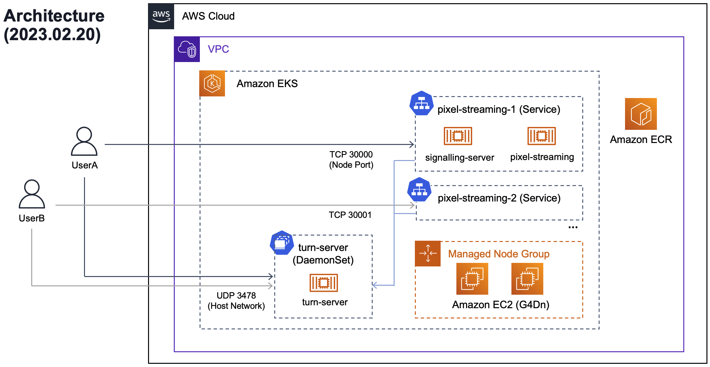

# pixel-streaming-on-eks

Sample code for deploying Unreal Engine Pixel Streaming on Amazon EKS. 

## Deployment

1. First follow the instructions on how to build an Unreal Engine Pixel Streaming application [here](./docs/UNREAL_ENGINE_EN.md)

2. Then build the node AMI and deploy the EKS cluster and container images using the instructions [here](./docs/DEPLOY_DEMO.md)

## Architecture

## Important Notes
- The PixelStreaming and SignallingServer contained in the `./containers` directory utilizes [Docker images](https://github.com/orgs/epicgames/packages/container/package/unreal-engine) provided by [Epic Games](https://github.com/EpicGamesExt/PixelStreamingInfrastructure?tab=readme-ov-file). 
The images used are the latest as of their release, but they **contain known vulnerabilities**. Please scan them with tools like [trivy](https://github.com/aquasecurity/trivy) as needed, and respond to the vulnerabilities accordingly.
- In the applications deployed in the demo, unless restricted by SecurityGroup rules, anyone can freely access the SignallingServer. Make sure to implement authentication, or other access control measures as per your requirements.

## Contributing

See [CONTRIBUTING](CONTRIBUTING.md#security-issue-notifications) for more information.

## License

This library is licensed under the MIT-0 License. See the [LICENSE](LICENSE) file.
