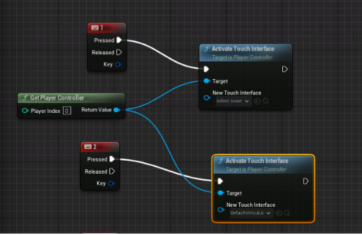

# How to Create a Pixel Streaming Project in Unreal Engine

## Summary
- Build instructions for Pixel Streaming project to be used with Amazon Elastic Kubernetes Service

## Prerequisites
- Operating System : Windows 10 or higher
- Unreal Engine : 5.0.3 or higher
- Visual Studio 2019 or higher

## Downloading UE and Creating a Project
- Download and launch the Epic Games Launcher, select Unreal Engine > Library, click on the "+" on the right of ENGINE VERSIONS, and select the version you want to download.
- After the download finishes, launch Unreal Engine and create a Pixel Streaming project. For this example, we will create a default "Third Person" project.

### References
- https://www.unrealengine.com/en-US/download
- https://docs.unrealengine.com/5.0/en-US/creating-a-new-project-in-unreal-engine/

## Building for Pixel Streaming
- Select Edit > Plugins
    - Choose the Pixel Streaming plugin, then restart Unreal Engine.
- Select Edit > Editor Preferences...
    - In the Level Editor > Play category, set the following values for Additional Launch Parameters:
        - ``` -AudioMixer -PixelStreamingIP=localhost -PixelStreamingPort=8888 ```

### References
- https://docs.unrealengine.com/5.0/en-US/getting-started-with-pixel-streaming-in-unreal-engine/

## Cross-compiling for Linux
- To cross-compile for Linux, download and install clang.
The version of clang required varies based on the Unreal Engine version. For example, for 5.0.3 use clang-13.0.1-based.
    - https://cdn.unrealengine.com/CrossToolchain_Linux/v20_clang-13.0.1-centos7.exe
- After downloading and installing, restart Unreal Engine. 
- Verify that the installation was successful
TODO insert screenshot
- You can now select Linux from the Platforms in Unreal Engine, and compile for Linux.

TODO Copy the package to the `containers/pixel-streaming/ue5-sample/` directory

### References
- https://docs.unrealengine.com/5.1/en-US/linux-development-requirements-for-unreal-engine/

## (Optional) How to Show and Hide the Controller
- Displaying the Controller
    - From the UE menu, select Edit > Project Settings > Input.
    - Check the Always Show Touch Interface under Mobile to display the controller.
    - Check Use Mouse for Touch under Mouse Properties to enable debugging with the mouse.
- How to Switch Display
    - Use the Activate Touch interface.
        - https://docs.unrealengine.com/5.0/en-US/BlueprintAPI/Game/Player/ActivateTouchInterface/
    - It is a method of Player Controller, so call it from Get Player Controller.
    - Set the controller you want to use for New Touch Interface. If you leave it at default, you can't set the UE default controller (as it doesn't appear in the Content Drawer). To make the Engine built-in Assets visible, check Show Engine Content in the Content Drawer settings. This will make DefaultVirtualJoyStick, which is built into UE, visible.
    - Set the New Touch Interface you want to display when you want to show it, and leave the New Touch Interface unset when you want to hide it.
        - Example
            - 